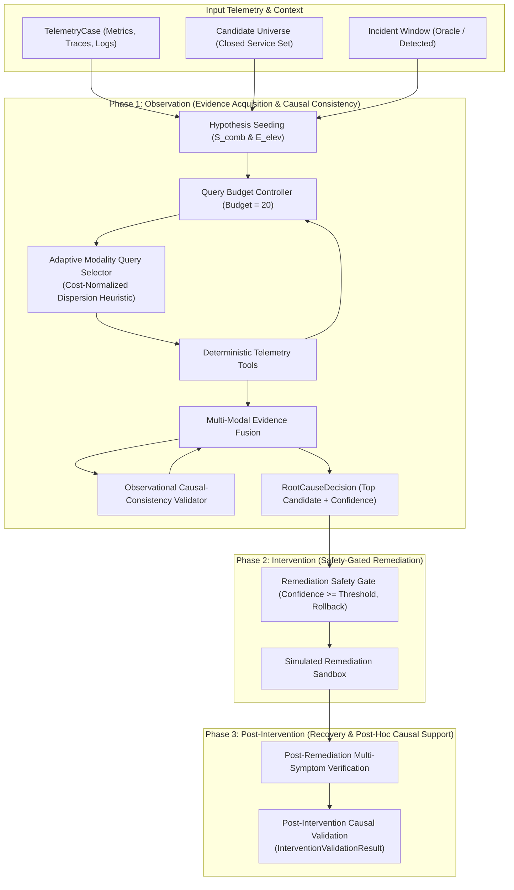

# Digital Detective: Autonomous Investigation Core

## 1. Executive Summary

This document describes the architectural design and operational mechanics of the deterministic **Digital Detective Core** engine (`digital_detective.detective`).

The system operationalizes autonomous root-cause investigation across distributed microservice architectures under strict query budget constraints. The architecture is cleanly organized into three distinct phases:
1. **Observation Phase**:
   - **Deterministic Modality-Aware Evidence Acquisition**: Budget-constrained telemetry queries selected via deterministic modality discrimination normalized by query cost.
   - **Multi-Modal Evidence Fusion**: Transparent combination of metrics, trace latencies, service logs, topology adjacency, and temporal precedence into posterior suspicion rankings.
   - **Observational Causal-Consistency Validation**: Auditing temporal ordering, topological connectivity, and propagation compatibility against domain constraints without speculative DAGs.
2. **Intervention Phase**:
   - **Safety-Gated Simulated Remediation**: Precondition validation and mandatory rollback definitions preventing interventions on healthy bystanders or unconfident diagnoses.
3. **Post-Intervention Phase**:
   - **Multi-Symptom Recovery Verification**: Comprehensive verification requiring root-cause clearance and downstream symptom resolution before declaring an incident resolved.
   - **Post-Intervention Causal Validation**: Post-hoc evaluation of system-wide symptom response to assess causal support (`INTERVENTION_SUPPORTS_HYPOTHESIS`, `INTERVENTION_INCONCLUSIVE`, `INTERVENTION_CONTRADICTS_HYPOTHESIS`) strictly without modifying pre-intervention rankings.

> [!IMPORTANT]
> **Prototype & Methodological Boundary Declarations:**
> - This engine is an autonomous deterministic prototype.
> - **No Formal Causal Inference Claimed**: The system does NOT perform formal interventional causal inference (e.g., Pearlian do-calculus, DAG structural learning, or interventional structural causal models). Observational validation audits consistency with empirical domain constraints, and post-intervention validation evaluates empirical recovery response post-hoc.
> - Remediation actions are **strictly sandboxed / simulated** (no destructive production cluster changes).
> - LLM reasoning and RAG knowledge retrieval are deferred to subsequent architectural layers; the deterministic core serves as the evidence and safety foundation.

---

## 2. Architecture Overview



---

## 3. Investigation State & Trajectory

The investigation lifecycle is encapsulated in an explicit, immutable-transition state machine (`InvestigationState`):

- **Incident Context**: `incident_id`, `system`, `candidate_universe`.
- **Budget Tracking**: `budget`, `remaining_budget`, `total_query_cost`.
- **Audit Logs**:
  - `queries_executed`: Sequential list of `ToolQueryRecord` with tool name, target service, cost, timestamp, and status (`SUCCESS` or `REJECTED_BUDGET`).
  - `evidence_collected`: Multi-modal `EvidenceItem` records with normalized signal magnitude and confidence contributions.
- **Ranked Hypotheses**: Dynamic ordering of all candidate services with score components and posterior confidence.
- **Root-Cause Decision**: Final immutable diagnosis with supporting and contradicting evidence sets.
- **Remediation & Recovery**: Structured records of proposed actions, safety gate evaluations, simulated execution outputs, and recovery verification verdicts.

---

## 4. Deterministic Telemetry Tools & Query Budget

### 4.1 Configurable Tool Registry & Query Costs

Every query executed by the investigator consumes an explicit cost from a non-replenishable budget (default $B = 20$):

| Tool Name | Operation | Default Cost | Output Evidence Modality |
| :--- | :--- | :---: | :--- |
| `get_metrics` | Queries entity metric anomaly episodes & peak z-scores | 1 | `metrics` |
| `get_service_health` | Queries current operational health & error state | 1 | `health` |
| `get_neighbors` | Extracts 1-hop upstream callers and downstream callees | 1 | `topology` |
| `get_recent_change` | Audits deployment history, config updates, restarts | 2 | `recent_change` |
| `get_logs` | Queries service log records for errors / exceptions | 2 | `logs` |
| `get_traces` | Extracts service call span latencies and elevated delays | 3 | `traces` |

### 4.2 Hard Budget Enforcement

The `DetectiveTools` executor strictly gates all requests:
1. If `cost > remaining_budget`, the query is **immediately rejected**.
2. A `ToolQueryRecord` is logged with status `REJECTED_BUDGET`.
3. The remaining budget is **untouched**.
4. No telemetry evidence is leaked or returned.
5. Once budget reaches 0 or no query can be afforded, the investigation loop terminates deterministically.

---

## 5. Investigation Loop & Evidence Acquisition Heuristics

The engine runs a deterministic investigation loop over discrete query turns:

1. **Initial Screening**: Baseline hypothesis scores are seeded using frozen metric ranking ($S_{\text{comb}}$) and trace elevation ($E_{\text{elev}}$).
2. **Evidence Acquisition Heuristic**:
   The engine supports two deterministic selection policies, controlled via the `adaptive_query_selection` feature flag.

### 5.1 Adaptive Modality-Aware Heuristic (`adaptive_query_selection=True`, Default)

Rather than using static priority weights across modalities, the **deterministic modality-aware evidence acquisition heuristic** dynamically prioritizes tools that can best differentiate the leading hypotheses per unit of query cost.

> [!NOTE]
> **Methodological Clarification**: This heuristic is **not** formal information gain and does **not** perform probabilistic belief-state modeling. It is a lightweight, fully deterministic dispersion heuristic designed to discriminate top candidates under a bounded query budget.

#### Mathematical Formulation

For the current top-$K$ candidates (default $K = 3$) ordered by hypothesis score:
1. **Modality Evidence Vector**:
   For each candidate $c \in \text{top-}K$ and modality $m \in \mathcal{M}$, let $v_{c, m} \in [0, 1]$ denote the normalized magnitude of collected evidence for service $c$ in modality $m$ (or $0.0$ if no evidence collected).

2. **Modality Dispersion & Discrimination**:
   $$\text{dispersion}(m) = \max_{c \in \text{top-}K}(v_{c, m}) - \min_{c \in \text{top-}K}(v_{c, m})$$
   $$\text{discrimination}(m) = \text{dispersion}(m) + \delta \quad (\delta = 0.15)$$
   where $\delta = 0.15$ ensures a non-zero baseline discrimination for unobserved modalities across the top-$K$.

3. **Query Priority per Candidate and Affordable Tool**:
   For candidate service $s$ and affordable tool $t$ querying modality $m$:
   $$\text{Priority}(s, t) = \frac{\text{base\_suspicion}(s) \times \text{unexplored\_factor}(s) \times \text{discrimination}(m) \times \text{missing\_evidence\_factor}(s, m)}{\text{query\_cost}(t)}$$
   where:
   - $\text{base\_suspicion}(s) = \text{HypothesisScore}(s) \in [0, 1]$.
   - $\text{unexplored\_factor}(s) = \frac{1.0}{1.0 + N_{\text{queries}}(s)}$ penalizes over-querying a single service.
   - $\text{missing\_evidence\_factor}(s, m) = 1.6$ if service $s$ has no evidence in modality $m$, and $0.7$ if already observed.
   - $\text{query\_cost}(t) \in \{1, 2, 3\}$ penalizes high-cost modalities to maximize evidence acquired per budget unit.

4. **Deterministic Tie-Breaking**:
   All candidates are ranked deterministically by the key tuple:
   $$(-\text{Priority}(s, t), -\text{query\_cost}(t), s, t)$$
   ensuring reproducible execution across platforms without case-specific hardcoding.

### 5.2 Legacy Fixed-Priority Heuristic (`adaptive_query_selection=False`)

Retained for comparative evaluation:
$$\text{Priority}_{\text{legacy}}(s, t) = \text{HypothesisScore}(s) \times \frac{1.0}{1.0 + N_{\text{queries}}(s)} \times W_{\text{tool}}(t) \times M_{\text{missing}}(s, t)$$
with fixed static weights $W_{\text{metrics}}=1.2$, $W_{\text{health}}=1.1$, $W_{\text{change}}=1.0$, $W_{\text{traces}}=0.9$, $W_{\text{topology}}=0.8$, $W_{\text{logs}}=0.7$, and no cost normalization.

### 5.3 Loop Execution & Stop Conditions

3. **Execution & Evidence Update**: The highest-priority affordable query is executed, and its cost is deducted from `remaining_budget`.
4. **Re-Ranking & Consistency Evaluation**: All candidate hypotheses are dynamically re-ranked via `EvidenceFusion` and `CausalConsistencyValidator`.
5. **Deterministic Stop Condition**:
   The loop terminates if:
   - Budget is exhausted or insufficient for any query, OR
   - Early stopping criteria are met: top candidate has at least 2 queries, leading margin $\ge 15\%$, confidence $\ge \text{threshold}$, and causal consistency passes.

---

## 6. Multi-Modal Evidence Fusion & Score Semantics

The architecture cleanly decouples and formalizes the distinct notions of evidence, consistency, composite suspicion, and decision confidence:

1. **`evidence_score`** ($E(s) \in [0, 1]$):
   Direct linear combination of min-max normalized modality signals:
   $$E(s) = \sum_{m \in \mathcal{M}} W_m \cdot \bar{S}_m(s)$$
   where $\sum W_m = 1.0$, and components are:
   - $\bar{S}_{\text{metric}}$: Peak anomaly episode intensity / $S_{\text{comb}}$ signal ($W_m = 0.30$).
   - $\bar{S}_{\text{trace}}$: Trace span latency elevation / $E_{\text{elev}}$ signal ($W_m = 0.30$).
   - $\bar{S}_{\text{change}}$: Recent deployment or restart indicator ($W_m = 0.15$).
   - $\bar{S}_{\text{temporal}}$: Precedence score based on relative episode onset ($W_m = 0.10$).
   - $\bar{S}_{\text{log}}$: Log-transformed error occurrence $\log(1 + N_{\text{errors}})$ ($W_m = 0.10$).
   - $\bar{S}_{\text{topology}}$: Graph centrality / dependency degree ($W_m = 0.05$).

2. **`consistency_score`** ($C(s) \in [0, 1]$):
   Causal-consistency validation score from `CausalConsistencyValidator`:
   $$C(s) = 0.35 \cdot \text{TemporalScore}(s) + 0.35 \cdot \text{TopologyScore}(s) + 0.30 \cdot \text{PropagationScore}(s)$$

3. **`composite_score`** ($S(s) \in [0, 1]$):
   Consistency-modulated suspicion score used to order candidates:
   $$S(s) = E(s) \times (0.4 + 0.6 \cdot C(s))$$

4. **`decision_confidence`** ($D(s_1) \in [0, 1]$):
   Posterior confidence in the top-ranked hypothesis $s_1$ combining composite score, consistency, and margin of separation over the runner-up $s_2$:
   $$D(s_1) = S(s_1) \times \left(0.75 + 0.25 \cdot \frac{S(s_1) - S(s_2)}{S(s_1)}\right)$$

---

## 7. Causal-Consistency Validation

The `CausalConsistencyValidator` performs four checks:

1. **Temporal Ordering**:
   - Suspected root cause onset $t_{\text{target}}$ is compared against downstream symptom onsets $t_{\text{downstream}}$.
   - $t_{\text{target}} \le \min(t_{\text{downstream}}) \implies \text{TemporalScore} = 1.0$.
   - $t_{\text{target}} - \min(t_{\text{downstream}}) \le 15\text{s} \implies \text{TemporalScore} = 0.85$ (accounts for 10-15s rolling window detection lag).
   - Inversions beyond tolerance trigger warnings and assign $\text{TemporalScore} = 0.40$.
2. **Topological Reachability**:
   - Audits whether the target has direct or 2-hop graph connectivity to services exhibiting symptoms.
   - Connected $\implies \text{TopologyScore} = 1.0$; isolated $\implies \text{TopologyScore} = 0.50$.
3. **Propagation Consistency**:
   - Checks whether target internal faults (CPU, memory, errors) manifest as caller latency elevation in downstream services.
   - Present $\implies \text{PropagationScore} = 1.0$; absent $\implies \text{PropagationScore} = 0.50$.
4. **Evidence Independence**:
   - Verifies that target suspicion is supported by at least two distinct modalities, emitting a warning if suspicion relies on a single signal source.

---

## 8. Remediation Safety Gate & Simulated Execution

### 8.1 Strict Safety Gate Rules

Before any intervention is scheduled, `validate_remediation` enforces six mandatory invariant checks:
1. **Confidence Threshold Gate**: Diagnosis confidence must meet or exceed the configured remediation threshold (default $\ge 0.80$). If confidence is below the threshold, automatic execution is strictly **BLOCKED**, setting investigation state to `DIAGNOSIS_COMPLETE` and requiring explicit operator override (`allow_low_confidence=True`).
2. **Approved Action Type**: Action must belong to `SUPPORTED_ACTIONS` (`restart_service`, `rollback_deployment`, `scale_service`, `clear_connection_pool`).
3. **Mandatory Rollback**: Non-empty rollback plan must be declared.
4. **Candidate Universe Alignment**: Target service must belong to the closed candidate universe.
5. **Target Decision Match**: Target service must match the root-cause decision.
6. **No Healthy Bystanders**: Target service must possess verified degradation evidence ($>0$). Interventions on healthy services are strictly blocked.

### 8.2 Investigation Status Distinctions

- `DIAGNOSIS_COMPLETE`: The engine has localized the root cause, but remediation has not executed (e.g. held by safety threshold).
- `REMEDIATION_AUTHORIZED`: Remediation passed all safety gates and was executed in the simulation sandbox.

### 8.3 Deterministic Transformation Simulation

> [!CAUTION]
> **Honest Simulation Disclaimer**: The system does NOT manufacture a fabricated "after" state guaranteeing recovery, nor does it mutate actual cluster infrastructure. It applies a deterministic mathematical transformation model:

1. **Blocked / Failed Remediation**: Post-remediation state is identical to pre-remediation state ($0\%$ recovery). Verification assesses `NOT_RESOLVED`.
2. **Successful Remediation**:
   - Target Service: `scale_service` reduces anomaly score by $85\%$ and latency by $80\%$; `restart_service` reduces anomaly by $90\%$ and latency by $75\%$.
   - Dependent Call Graph: Connected caller/callee services in the dependency graph have latency queues and anomaly symptoms reduced by $85\%$.
   - Unconnected Services: Mild ambient cluster-wide load contention is reduced by $50\%$; genuine independent severe anomalies remain degraded.

---

## 9. Post-Remediation Verification & Post-Intervention Causal Validation

### 9.1 Multi-Symptom Recovery Verification

`verify_recovery(before_state, after_state)` requires broad system health restoration:
- **Anomaly Score Reductions**: Evaluates whether target and dependent anomaly scores drop below baseline thresholds.
- **Latency Normalization**: Evaluates downstream $P_{90}$ latency normalization.
- **Error Clearance**: Evaluates HTTP 5xx error reductions.
- **Regression Detection**: Explicitly audits whether any previously healthy service experienced increased error counts or elevated anomaly scores. If a regression is detected, the status is immediately flagged `NOT_RESOLVED`.
- **Final Verdicts**:
  - `RESOLVED`: Target and dependent metrics cleared, zero regressions.
  - `UNCERTAIN`: Target cleared, but secondary symptoms remain unsettled.
  - `NOT_RESOLVED`: Target remains degraded, or regression was detected.

### 9.2 Post-Intervention Causal Validation (`InterventionValidationResult`)

Following remediation execution and recovery verification, `validate_intervention` performs post-hoc causal assessment:

```python
@dataclass(frozen=True)
class InterventionValidationResult:
    target_service: str
    action: str
    pre_intervention_consistency: float
    recovery_verified: bool
    downstream_recovery: bool
    regression_detected: bool
    causal_support: str  # INTERVENTION_SUPPORTS_HYPOTHESIS | INTERVENTION_INCONCLUSIVE | INTERVENTION_CONTRADICTS_HYPOTHESIS
    explanation: str
```

#### Verdict Semantics

1. **`INTERVENTION_SUPPORTS_HYPOTHESIS`**:
   Targeted intervention on the candidate produces broad recovery of the symptoms attributed to that candidate (both root-cause and downstream dependent symptoms) with zero detected regressions.
2. **`INTERVENTION_CONTRADICTS_HYPOTHESIS`**:
   The intervention either induced new regressions on previously healthy services, or completely failed to resolve the target candidate's degradation (`NOT_RESOLVED`).
3. **`INTERVENTION_INCONCLUSIVE`**:
   Partial recovery was achieved, or secondary symptoms remain unsettled without outright contradiction.

> [!IMPORTANT]
> **Post-Hoc Invariant**: Post-intervention causal validation is strictly post-hoc evaluation. It provides operational verification of remediation efficacy and observational support, but **MUST NOT modify** the original pre-intervention RCA rankings, composite scores, or confidence values.

---

## 10. Summary of Architectural Phases & Boundaries

| Phase | Component | Nature | Description & Guarantees |
| :--- | :--- | :--- | :--- |
| **Observation** | Telemetry Tools & Budget | **Deterministic** | Parquet extraction under non-replenishable query budget. Zero ground truth access. |
| **Observation** | Modality-Aware Query Selection | **Deterministic** | Dispersion heuristic across top-$K$ candidates normalized by tool query cost. |
| **Observation** | Evidence Fusion & Scoring | **Deterministic** | Linear multi-modal combination modulated by observational causal consistency. |
| **Observation** | Causal Consistency Audit | **Deterministic** | Graph path traversal and observed timestamp comparisons (no DAG inference). |
| **Intervention** | Remediation Safety Gate | **Deterministic** | Hard threshold gate ($\ge 0.80$ default), action whitelist, and mandatory rollback. |
| **Intervention** | Remediation Sandbox | **Simulated** | Deterministic mathematical response model; no live cluster mutation. |
| **Post-Intervention** | Recovery Verification | **Deterministic Audit** | Evaluates target anomaly reduction, downstream latency, and regression detection. |
| **Post-Intervention** | Causal Support Validation | **Post-Hoc Verdict** | Evaluates empirical symptom clearance (`SUPPORTS`, `INCONCLUSIVE`, `CONTRADICTS`). |

---

## 11. Safety and Operational Evaluation Metrics

In addition to standard localization metrics (Top@1, Top@3, Top@5, MRR), the evaluation harness reports five dedicated safety and operational metrics:

1. **`abstention_rate`**:
   $$\text{Abstention Rate} = \frac{N_{\text{abstained}}}{N_{\text{total}}}$$
   Measures the proportion of cases where the system safely refrained from diagnosing or authorizing automated remediation due to low confidence or ambiguous evidence.
2. **`false_remediation_rate`**:
   $$\text{False Remediation Rate} = \frac{N_{\text{authorized on incorrect target}}}{N_{\text{authorized remediations}}}$$
   Measures the rate of incorrect interventions authorized by the safety gate. If $N_{\text{authorized remediations}} = 0$, reported as `N/A`.
3. **`recovery_success_rate`**:
   $$\text{Recovery Success Rate} = \frac{N_{\text{remediations with verified recovery}}}{N_{\text{authorized remediations}}}$$
   Measures whether authorized interventions successfully remediated the incident. If $N_{\text{authorized remediations}} = 0$, reported as `N/A`.
4. **`regression_rate`**:
   $$\text{Regression Rate} = \frac{N_{\text{remediations inducing regression}}}{N_{\text{authorized remediations}}}$$
   Measures interventions that introduced new anomalies on healthy services. If $N_{\text{authorized remediations}} = 0$, reported as `N/A`.
5. **`query_efficiency`**:
   $$\text{Query Efficiency} = \frac{N_{\text{Top@1 hits}}}{\sum N_{\text{queries executed}}}$$
   Measures diagnostic accuracy achieved per unit of telemetry inquiry. If zero queries are executed, reported as `N/A`.

